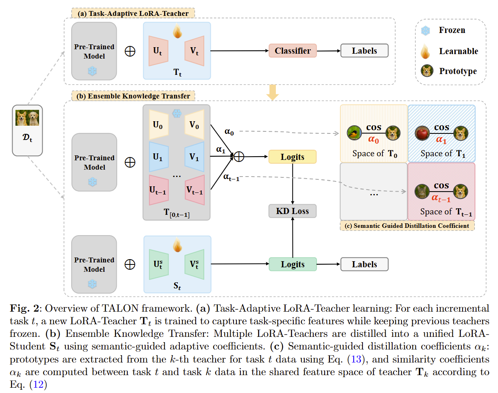

## 🌟 Dependencies

1. torch 2.0.1
2. torchvision 0.15.2
3. timm 0.6.12
4. tqdm
5. numpy
6. scipy
7. easydict

### 🔑 Run experiment

1. Edit the `scripts/[MODEL NAME].json` file for global settings and hyperparameters.

2. Run:

   ```bash
   cd scripts
   python main.py --config=./scripts/talon_cifar_B60_Inc5.json
   ```

3. `hyper-parameters`

   You can edit the global parameters and algorithm-specific hyper-parameter in the corresponding json file.

   These parameters include:

   - **init_cls**: The number of classes in the initial incremental stage.
   - **increment**: The number of classes in each incremental stage $i$, $i$ > 1. By default, the number of classes is equal across all incremental stages.
   - **backbone_type**: The backbone network of the incremental model. It can be selected from a variety of pre-trained models available in the Timm library, such as **ViT-B/16-IN1K** and **ViT-B/16-IN21K**. Both are pre-trained on ImageNet21K, while the former is additionally fine-tuned on ImageNet1K.
   - **seed**: The random seed is utilized for shuffling the class order. It is set to 1993 by default, following the benchmark setting iCaRL.
   - **t_rank**: The rank of LoRA-Teacher
   - **t_lora_positions**: The positions of LoRA-Teacher over {'q','k','v','mlp'}

### 🔎 Datasets

We have implemented the pre-processing datasets as follows:

- **CIFAR100**: will be automatically downloaded by the code.
- **CUB200**: Google Drive: [link](https://drive.google.com/file/d/1Swpje08SXizLX1QCJzNayIMgvHU1gtVe/view?usp=sharing)
- **miniImageNet**: Google Drive: [link](https://drive.google.com/file/d/1Nq7J-y17cNRDs7bG2h_PTbX1vBYKJ16u/view?usp=sharing)

These subsets are sampled from the original datasets. Please note that I do not have the right to distribute these datasets. If the distribution violates the license, I shall provide the filenames instead.

When training **not** on `CIFAR100`, you should specify the folder of your dataset in `utils/data.py`.

```python
    def download_data(self):
        assert 0,"You should specify the folder of your dataset"
        train_dir = '[DATA-PATH]/train/'
        test_dir = '[DATA-PATH]/val/'
```